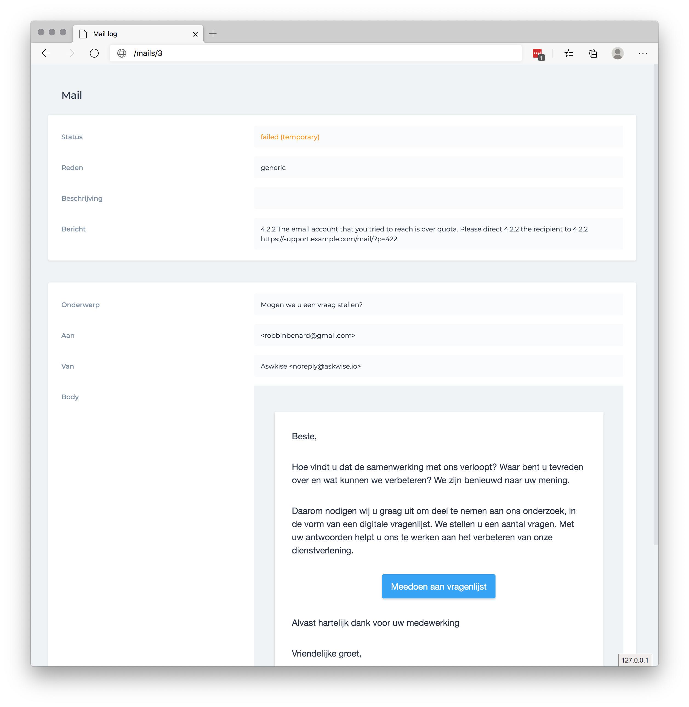
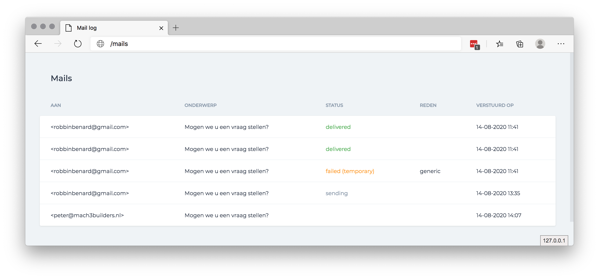

## Mail log






## Installation

You can install the package via composer:

```bash
composer require mach3builders/mail-log
```

You can publish and run the migrations with:

```bash
php artisan vendor:publish --provider="Mach3builders\MailLog\MailLogServiceProvider" --tag="migrations"
php artisan migrate
```

You can publish the config file with:

```bash
php artisan vendor:publish --provider="Mach3builders\MailLog\MailLogServiceProvider" --tag="config"
```

This is the contents of the published config file:

```php
return [
    'route_path' => 'mails', // The route prefix to use

    'middleware' => ['web', 'auth'],

    'signing_key' => env('MAIL_LOG_SIGNING_KEY'), // Mailgun signing key
];
```

### Setting up the webhook

Go to mailgun.org and setup 3 webhooks: delivered, temporary fail and permanent fail to point at ```mails/webhook```. The package won't accept any other webhooks for now.

Copy your webhook signing key and update ```MAIL_LOG_SIGNING_KEY``` in the config.

## Usage

When you require this package it will automaticaly start logging all e-mails sent.
Visit `/mails` to view all logged mails.

### Listening for changes

You can listen to ```MailUpdated``` event to update your own models. 
You can access ```$event->mail``` for the updated model.

```
protected $listen = [
        \Mach3builders\MailLog\Events\MailUpdated::class => [
            \App\Listeners\UpdateUserComfirmationEmail::class,
        ]
];
```

### Editting views

To edit the views used publish them and edit to your liking.

```bash
php artisan vendor:publish --provider="Kordy\Ticketit\TicketitServiceProvider" --tag="views"
```

## Testing

``` bash
composer test
```
